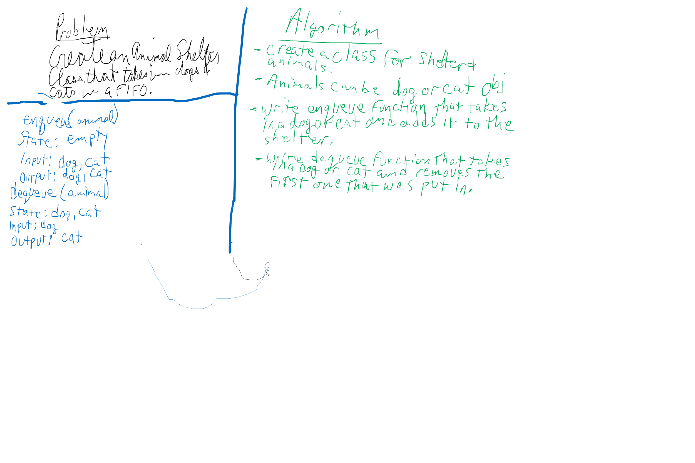

# Challenge Summary
First-in, First out Animal Shelter.

## Challenge Description
Create a class called AnimalShelter which holds only dogs and cats. The shelter operates using a first-in, first-out approach.
Implement the following methods:
enqueue(animal): adds animal to the shelter. animal can be either a dog or a cat object.
dequeue(pref): returns either a dog or a cat. If pref is not "dog" or "cat" then return null.

## Approach & Efficiency
Created an Animal Shelter class with a constructor and two methods. Created an Animal class with a constructor. Wrote unit tests to verify everything works as expected.

To put an animal in the shelter, I use `enque(animal)` and to remove an animal from the shelter, I use `dequeue(animal)`. `animal` refers to name or type. `dequeue()` will return the animal that was put in first.

## Solution

